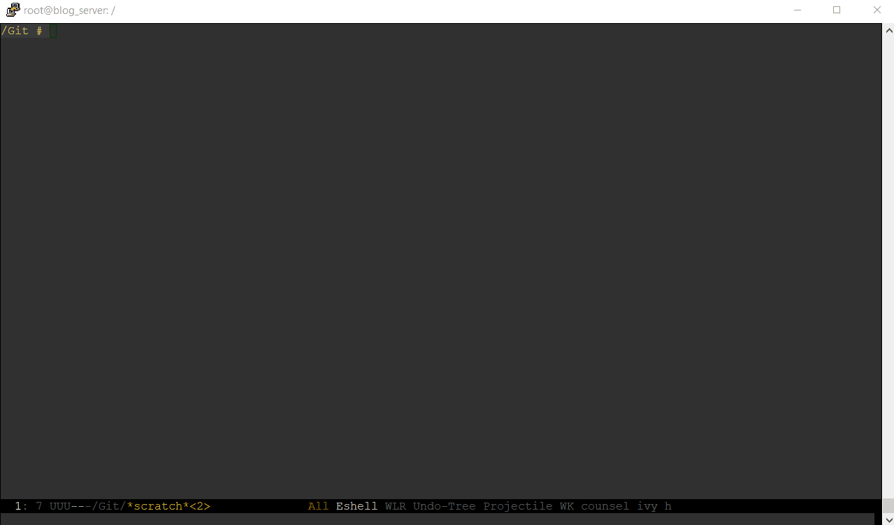

# command
collection of random command line functions

| Group   | Command      | Long                                   | Shortcut   | Demo   |
|---------|--------------|----------------------------------------|------------|--------|
| News    | Google Trend | command news gtrend <br/> command n tr | cmd n tr   | [Here] |
|         | Hacker News  | command news hackernews                | Hackernews | [Here] |
|         | KD nuggents  | command news kdnuggets                 | KD nuggets | [Here] |
|         | Reddit       | command news reddit                    | Reddit     | [Here] |
|         | Twitter      | command news twitter <br/> command n t | Twitter    | [Here] |
|         |              |                                        |            |        |
| Utility | Cheat sheet  | command utility cheatsheet             | Cheatsheet | [Here] |
|         | Strip HTML   | command utility stripHtml              |            | [Here] |
|         |              |                                        |            |        |


# Installation
I would **NOT RECOMMEND** downloading any executable to your system directly. A better way would be compiling from the source code with your Go environment.

Use the following command at you own risk. It will download the executable to your binary directory

```
cd ~/bin
wget https://github.com/billylkc/command/blob/master/bin/command?raw=true
```

and call it with `command`


# Demo

